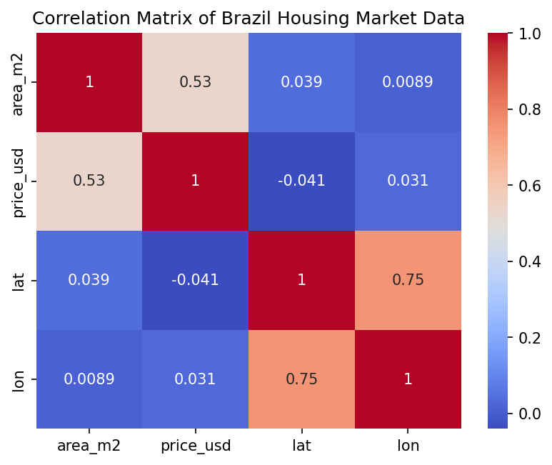

# Brazil Housing Market: Exploratory Data Analysis

**Author:** Nehemiah Eremiye

## Research Question

Are property prices in Brazil more influenced by property size (area) or by location (region/state)?

This project explores a combined dataset of Brazilian real estate listings to answer that question, moving from descriptive statistics through univariate and bivariate analysis, correlation analysis, feature engineering, and a variance decomposition to isolate the relative contribution of size versus location to price.

## Dataset

Two raw CSV files of Brazilian property listings (collected 2015–2016):
- `brasil-real-estate-1.csv` — 12,834 rows × 6 columns
- `brasil-real-estate-2.csv` — 12,833 rows × 7 columns

**Data Cleaning:**
- Dropped rows with missing values (1,283 missing `lat-lon` entries in Dataset 1; missing `area_m2` entries in Dataset 2)
- Parsed the `place_with_parent_names` field to extract a `state` column
- Split `lat-lon` into separate `lat` / `lon` float columns
- Converted `price_usd` from a formatted string (`"$187,230.85"`) to a numeric float
- Converted Dataset 2's `price_brl` to `price_usd` using the 2015–2016 exchange rate (1 USD ≈ 3.19 BRL), then dropped the original `price_brl` column
- Verified column alignment between both datasets before concatenating

**Combined dataset:** 22,844 rows × 7 columns, no missing values, verified with row-count, column-count, and index sanity checks after concatenation.

## Methods for Analysis

- **Descriptive statistics** on `price_usd` and `area_m2`
- **Univariate analysis** — histograms of price and area distributions
- **Bivariate analysis** — boxplots of price by property type, region, and state
- **Correlation analysis** — Pearson correlation between area and price, both overall and segmented by region, state, and property type
- **Feature engineering** — derived `price_per_m2` as a location/quality-normalized value metric
- **Variance decomposition** — quantified between-state vs. within-state variance in price to directly test whether location or size explains more price variation

Tools: `pandas`, `numpy`, `matplotlib`, `seaborn`

## Key Findings

- **Price and area are both right-skewed.** Most properties are moderately priced/sized, but a small number of luxury listings pull the mean well above the median in both variables.
- **Area is a moderate positive predictor of price overall** (r ≈ 0.53), but this single number hides a lot of regional variation.

- **The area-price relationship is strongest in the North and Northeast** (size is a reliable price predictor there) and **weakest in the Southeast**, Brazil's most urban, densely populated region — where small properties can command high prices due to proximity to city centers rather than size.
- **Apartments show a stronger area-price correlation (r ≈ 0.65) than houses (r ≈ 0.54)**, suggesting non-size factors matter more for house pricing.
- **`price_per_m2` reveals a "law of diminishing returns"** — smaller properties consistently command a higher price per square meter than larger ones.
- **Location effects are large in absolute terms:** the median `price_per_m2` in Rio de Janeiro (~ $2,211) is roughly 2.5–3x that of the least expensive states like Mato Grosso do Sul (~ $685) — meaning an identically sized property is worth dramatically more based on where it sits.

- **Variance decomposition** shows within-state variance exceeds between-state variance (ratio < 1), indicating that once you're inside a given state, factors like property type and size still account for meaningful price variation — location narrows the range but doesn't fully determine it.
- A strong lat/lon correlation (~0.75) was also observed, but this is a **geographic artifact** of Brazil's coastline shape and regional listing density, not a substantive finding.

## Conclusion

Both size and location influence property prices, but location — specifically region and state — is the stronger driver of price *per square meter*. Knowing a property sits in São Paulo or Rio de Janeiro versus a rural state conveys more pricing information than knowing its size alone. That said, the variance decomposition shows within-state differences (property type, size, neighborhood) still account for a substantial share of price variation, so location sets the range but doesn't fully determine the outcome within it.

## Recommendations for Further Analysis

- Incorporate features not in the current dataset — year built, property condition, proximity to transit — that likely affect `price_per_m2`
- Explore temporal effects (macroeconomic cycles, seasonality, year of sale)
- Investigate whether apartments' higher `price_per_m2` actually makes them a better investment, or whether other factors (maintenance costs, liquidity, appreciation) offset the premium

## Project Structure

```
├── data/
│   ├── brasil-real-estate-1.csv
│   └── brasil-real-estate-2.csv
├── images/
│   ├──correlation.png
│   ├──region_boxplot.png
│   └── states_boxplot.png
├── Brazil Housing Market - Exploratory Data Analysis.ipynb
└── README.md
```


## Tech Stack

`Python` · `pandas` · `numpy` · `matplotlib` · `seaborn` · `Jupyter Notebook`

## Author

**Nehemiah Eremiye**
[[LinkedIn](https://www.linkedin.com/in/nehemiah-eremiye-19114988/)] 

## Acknowledgements

Dataset originally developed from the WorldQuant University's Applied Data Science Lab was used for the Exploratory Data Analysis.
